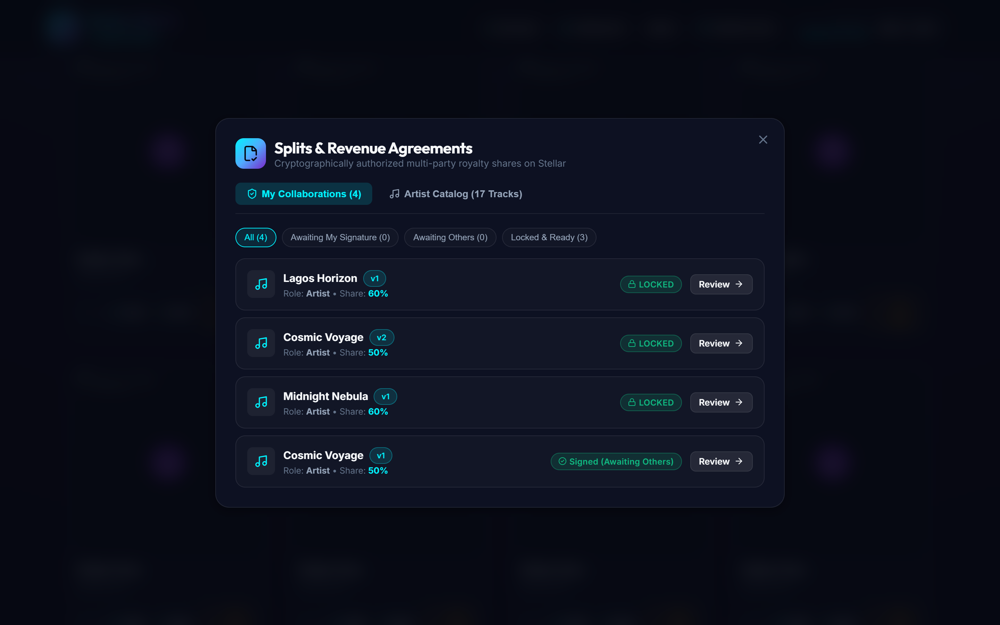

# 🎵 Stellar Music — Backend (`stellar-music-backend`)

[](https://stellar-music-app.netlify.app)
[](https://horizon-testnet.stellar.org)
[](https://www.typescriptlang.org/)
[](https://github.com/Stellar-Music/stellar-music-backend)

The production API, streaming accounting, and automated Stellar settlement reconciliation engine for **Stellar Music**.

---

## 📌 Architectural Responsibility & Core Principles

The backend manages catalog metadata, authenticated range audio delivery, cryptographic split verification, revenue pool tracking, and blockchain reconciliation:

* **Non-Custodial Principle**: The backend never holds custody of listener funds or artist royalties.
* **Smart Contract Authority**: All monetary disbursements and collaborator allocations are executed on the Stellar ledger backed strictly by immutable, locked agreements.
* **Deterministic Accounting**: Revenue pools ingest streaming payments, calculate multi-party splits using 10,000 basis points integer stroop math (zero rounding loss), execute on-chain distributions, and reconcile settlement transaction hashes against Stellar Horizon.
* **Realtime Streaming Updates**: Emits Server-Sent Events (SSE) upon settlement completion to provide immediate dashboard reactivity.

```
       [ Frontend Client ]
          │          │
 (Stream Audio)   (Purchase Pass)
          │          │
          ▼          ▼
   ┌─────────────────────────────────────────────────────────┐
   │                Stellar Music Backend                    │
   │  - Authenticated HTTP Range Streaming (206 Partial)    │
   │  - Horizon Payment Verification & Replay Protection     │
   │  - Revenue Pool Ingestion                               │
   │  - Automated Multi-Recipient Settlement Service         │
   │  - Event Streaming (SSE /api/realtime/events)           │
   └──────────────┬───────────────────────────┬──────────────┘
                  │                           │
                  ▼                           ▼
          [ Database Engine ]     [ Stellar Horizon Testnet ]
       - revenue_pools             - Transaction Verification
       - settlements               - Multi-Recipient Payments
       - settlement_recipients     - Ledger Reconciliation
```

---

## 📡 API Specification

### 1. Revenue Pools & Settlements

| Method | Endpoint | Description |
| :--- | :--- | :--- |
| `POST` | `/api/settlements/track/:trackId` | Triggers immediate multi-recipient settlement for a track using its active locked split. |
| `POST` | `/api/settlements/run` | Executes automated batch settlement across all eligible tracks with locked splits and pending revenue. |
| `GET` | `/api/settlements` | Queries global settlement ledger with recipient breakdowns. |
| `GET` | `/api/settlements/:id` | Fetches single settlement receipt and recipient payment allocations. |
| `GET` | `/api/settlements/reconcile/:id` | Reconciles settlement status and transaction hash against Stellar Horizon. |
| `GET` | `/api/revenue/pools` | Queries all active track revenue pools and balances. |
| `GET` | `/api/revenue/track/:trackId` | Audits gross revenue pool, locked split agreement, and settlement receipts for a track. |
| `GET` | `/api/earnings/contributor/:wallet` | Contributor Earnings Dashboard: total earned, pending, settled, and per-track allocations. |
| `GET` | `/api/earnings/artist/:wallet` | Artist Revenue Dashboard: catalog-level gross revenue, pending settlement, and disbursement progress. |
| `GET` | `/api/realtime/events` | Server-Sent Events (SSE) stream for real-time settlement and payment broadcasts. |

### 2. Collaborator Split Agreements

| Method | Endpoint | Description |
| :--- | :--- | :--- |
| `POST` | `/api/tracks/:trackId/splits` | Artist creates a new split agreement version with contributor percentages and roles. |
| `GET` | `/api/tracks/:trackId/splits` | Lists all agreement versions for a specific track. |
| `GET` | `/api/tracks/:trackId/splits/active` | Fetches active locked agreement ready for settlement execution. |
| `GET` | `/api/splits/:id` | Fetches agreement details, contributors, signatures, and lock state. |
| `POST` | `/api/splits/:id/sign` | Contributor signs/approves exact agreement terms. Automatically locks when all sign. |
| `POST` | `/api/splits/:id/reject` | Contributor rejects proposed terms. |
| `GET` | `/api/splits/:id/history` | Chronological audit trail of split creation, signatures, and locking events. |
| `GET` | `/api/me/splits?wallet=G...` | Fetches all agreements where the queried wallet is an artist or contributor. |

### 3. Catalog, Passes & Streaming

| Method | Endpoint | Description |
| :--- | :--- | :--- |
| `GET` | `/api/tracks` | Lists published tracks with optional search and genre filtering. |
| `GET` | `/api/tracks/:id` | Fetches single track metadata. |
| `POST` | `/api/tracks/upload` | Multipart file upload for audio and artwork files. |
| `POST` | `/api/tracks` | Publishes track metadata to catalog. |
| `POST` | `/api/passes` | Verifies Stellar Testnet transaction hash, prevents replay, and issues Music Pass. |
| `GET` | `/api/passes?wallet=G...` | Lists active music passes owned by a wallet. |
| `GET` | `/api/passes/check/:trackId/:wallet` | Verifies whether a wallet holds a valid access pass for a track. |
| `GET` | `/api/tracks/:id/stream` | Authenticated HTTP 206 Partial Content range stream for unlocked tracks. |
| `POST` | `/api/streams/start` | Initiates an authenticated streaming playback session. |
| `POST` | `/api/streams/:id/heartbeat` | Records listening duration and session heartbeat for active streams. |
| `POST` | `/api/streams/:id/end` | Ends an active playback session. |
| `GET` | `/api/streams` | Queries listening session history with optional track and listener filters. |

---

## 🛑 API Error Handling & Status Codes

All API endpoints return errors in a standardized JSON payload structure:

```json
{
  "success": false,
  "error": "Descriptive human-readable error explanation."
}
```

### Standard HTTP Error Codes

| Status Code | Error Message Pattern | Scenario & Root Cause |
| :---: | :--- | :--- |
| **`400 Bad Request`** | `"Invalid basis points: shares must total 10000"` | Split agreement allocation does not equal exactly 100.00%. |
| **`400 Bad Request`** | `"Duplicate contributor wallet in agreement"` | Same Stellar address provided for multiple roles in one split. |
| **`400 Bad Request`** | `"Agreement is already LOCKED"` | Attempted to sign or edit an immutable agreement version. |
| **`400 Bad Request`** | `"wallet_address is required."` | Missing required wallet query or body parameter. |
| **`400 Bad Request`** | `"Audio file is required."` | Missing multipart file upload payload. |
| **`402 Payment Required`** | `"A confirmed Music Pass is required to stream this track."` | Listener attempted to access stream without a verified on-chain pass. |
| **`403 Forbidden`** | `"Caller is not a registered recipient on this agreement."` | Wallet attempted to sign an agreement where it is not listed. |
| **`404 Not Found`** | `"Track not found"` | Track ID does not exist in the database. |
| **`404 Not Found`** | `"Agreement not found"` | Split agreement ID does not exist for the specified track. |
| **`404 Not Found`** | `"Audio file not found on server."` | Audio file reference does not exist on the file storage system. |
| **`409 Conflict`** | `"Replay detected: Transaction hash has already been redeemed."` | The Stellar transaction hash has already been used to issue a Music Pass. |
| **`412 Precondition Failed`** | `"Cannot settle: Agreement must be in LOCKED status."` | Settlement attempted before all required contributors signed. |
| **`416 Range Not Satisfiable`** | `"Requested range not satisfiable"` | HTTP Range header exceeds file byte boundaries. |
| **`500 Internal Error`** | `"Stellar Horizon RPC execution failure"` | Upstream network error when submitting or reconciling on Stellar. |

---

## 📸 Product Functionality Walkthrough

The backend powers the streaming delivery, payment verification, and automated settlement engine:

### 1. Music Discovery Catalog & Range Audio Delivery
Serves catalog metadata and delivers authenticated HTTP 206 Partial Content byte streams to unlocked listeners.


---

### 2. Payment Verification & Replay Protection (`POST /api/passes`)
Verifies Horizon payment hashes, asserts destination wallet and price match, prevents replay attacks, and issues non-custodial passes.


---

### 3. Collaborator Revenue Split Studio (`POST /api/tracks/:id/splits`)
Validates exact 10,000 basis points, tracks cryptographic signatures, computes SHA-256 agreement hashes, and locks agreements upon unanimous approval.


---

### 4. Contributor Royalty Accounting (`GET /api/earnings/contributor/:wallet`)
Calculates real-time lifetime earnings, pending pool royalties, and settled balances with linked Stellar Expert transaction hashes.


---

### 5. Automated Multi-Recipient Settlement Engine (`POST /api/settlements/run`)
Ingests streaming revenue into per-track pools, computes multi-recipient allocations, executes Stellar settlements, and broadcasts real-time SSE updates.


---

### 6. Public Track Revenue Auditor (`GET /api/revenue/track/:trackId`)
Provides open inspection of track revenue pools, active locked agreements, zero-leak remainder stroop dust allocations, and verified payout ledgers.


---

## 🧮 Settlement Math & Rounding Invariant

Settlements use integer arithmetic in Stellar stroops ($1\text{ XLM} = 10{,}000{,}000\text{ stroops}$):

1. **Gross Conversion**: $\text{gross\_stroops} = \text{round}(\text{amount\_xlm} \times 10{,}000{,}000)$
2. **Basis Points Distribution**: $\text{expected\_amount}_i = \lfloor \frac{\text{gross\_stroops} \times \text{bps}_i}{10000} \rfloor$
3. **Remainder Dust Preservation**:
   $$\text{dust} = \text{gross\_stroops} - \sum_{i=0}^{n-1} \text{expected\_amount}_i$$
   $$\text{actual\_amount}_0 = \text{expected\_amount}_0 + \text{dust}$$

This mathematical invariant guarantees:
* Zero stroop rounding loss
* Exact ledger matching
* Complete distribution of revenue pool funds

---

## 🗄️ Database Schema

The database supports SQLite (development) and PostgreSQL (production):

* `tracks`: Catalog metadata, audio references, pricing, status.
* `artists`: Artist profile records and payout wallets.
* `music_passes`: Verified on-chain pass purchases with transaction hashes.
* `streaming_sessions`: Playback heartbeats and stream duration accounting.
* `split_agreements`: Versioned revenue split agreements with lock status and SHA-256 term hashes.
* `split_contributors`: Contributor wallets, roles, percentages, basis points, signature state.
* `split_signatures`: Cryptographic signature records for agreement approvals.
* `agreement_events`: Immutable audit trail of agreement lifecycle events.
* `revenue_pools`: Per-track streaming revenue balances and settlement tracking.
* `settlements`: Historical settlement records, transaction hashes, and reconciliation status.
* `settlement_recipients`: Granular per-recipient payout records and stroop allocations.

---

## 🧪 Testing & Quality Assurance

Run the comprehensive automated test suite:

```bash
# Run unit and integration tests
npm test

# Build TypeScript production bundle
npm run build
```

All 23 backend tests execute cleanly with zero errors:
* Core health checks and error handlers
* Range audio streaming and 206 Partial Content delivery
* Payment verification and transaction replay prevention
* Split agreement creation, 10,000 basis points validation, and duplicate rejection
* Multi-party agreement signing, rejection, and atomic lock transition
* Revenue pool ingestion from verified Music Pass payments
* Integer-exact stroop multi-recipient settlement calculation and remainder dust allocation
* Track settlement execution and automated batch execution
* Contributor and artist earnings aggregations
* Blockchain reconciliation with Stellar Horizon

---

## 🚀 Running Locally

```bash
# Install dependencies
npm install

# Start development server
npm run dev

# Start production server
npm start
```

---

## 🌐 Network & Ecosystem Links

* **Live Web Application**: [https://stellar-music-app.netlify.app](https://stellar-music-app.netlify.app)
* **Frontend Web Application Repo**: [Stellar-Music/stellar-music-frontend](https://github.com/Stellar-Music/stellar-music-frontend)
* **Smart Contracts Repo**: [Stellar-Music/stellar-music-contracts](https://github.com/Stellar-Music/stellar-music-contracts)
* **Backend API & Settlement Engine Repo**: [Stellar-Music/stellar-music-backend](https://github.com/Stellar-Music/stellar-music-backend)
* **Stellar Horizon Testnet**: [https://horizon-testnet.stellar.org](https://horizon-testnet.stellar.org)
* **Stellar Testnet Explorer**: [Stellar Expert Explorer](https://stellar.expert/explorer/testnet)
